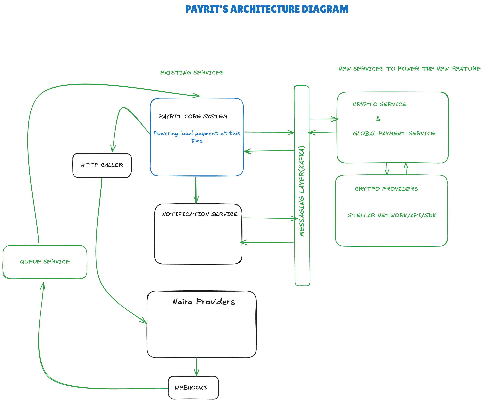

# PAYRIT
### Experience the fastest way to go global with your money

#### HIGHLEVEL ARCHITECTURE DIAGRAM

## 1. Backend system Component 
- Client Application : Mobile (IOS, ANDROID) and Rest API for integration with other products we provide services to. 
- Backend Service: Microservice architecture 
    - Payrit core system : Typescript,  NEST JS, 
    - Database: MongoDB, Redis, 
    - Messaging layer: Bull Mq, Kafka
    - Crypto service: Java, Spring boot
    - NGN provider: Anchor(BaaS)
    - Cyrpto/Cross border Provider/: Stellar Network

- Deployment and Infra:
    - We have multiple isolated environments on AWS which helps us host our backend services.
    - services: Elastic Beanstalk, EC2, Elastic Cache, AWS Code pipeline, Amazon MSK. e.t.c
    - Horizon: Host the Horizon docker images on EKS
    - Dedicated private cloud: Tunnel my dedicated local-running cpu to the internet using NGROK. This is a backup server which is used for testing pre-prod env and also a fallback env during system upgrade. 

## 2. Integration with Stellar
- Utilizing Stellar network, we offer user a blockchain wallet for supported assets starting with XLM and USDC
- Cross border payment:
    - Path Payments: Allows us to implement our "*spend in any country using your local currency*"
        - We would implement path payment strict Receive for this feature, because the goal is pay in any currency while trader, merchants get the real value for their goods or services

    - Stellar Anchor: We have integration with some of the anchors on stellar's anchor directory such as flutterwave and we will integrate with more of them.
    They will be help us collect funds in user's local currency and help deliver it to the destination asset/currency

- Enhancing our scan-to-pay and NFC feature
    - We currently operate in the local space in Nigeria. we started payrit with the initial goal of bridging the gap between the banked and the unbanked. This feature has been in our users' hand and it has allowed them to pay in rural settings where user need to sort for cash to pay the traders. With stellar integration we can now enhance this feature to allow user still use the scan-to-pay feature but debiting their crypto or alternate wallets

- 
